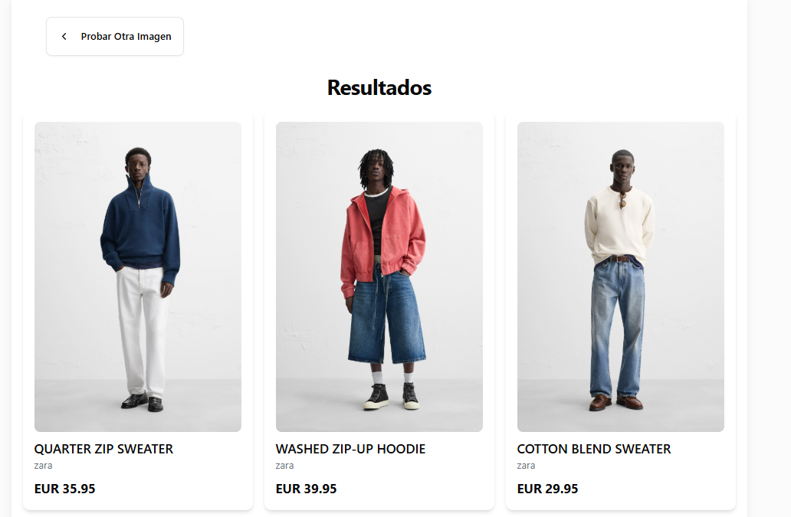

# BúsquedaVisual - Encuentra Productos con Imágenes


## 🔍 Visión General

Inditex Visual Search es una aplicación web moderna que permite a los usuarios encontrar productos similares subiendo imágenes, capturando fotos con la cámara o introduciendo URLs de imágenes. Desarrollada para HackUPC 2025, esta herramienta utiliza tecnologías avanzadas para simplificar la búsqueda de moda y productos visuales.



## ✨ Características

- **Múltiples métodos de entrada**: Sube imágenes, captura con la cámara o ingresa URLs de imágenes
- **Búsqueda visual**: Encuentra productos similares basados en imágenes
- **Interfaz moderna**: Diseño responsivo y atractivo con Tailwind CSS
- **Rendimiento optimizado**: Carga rápida y experiencia fluida

## 🛠️ Tecnologías

- **Frontend**: React 19.0.0, Next.js 15.3.1
- **Estilizado**: Tailwind CSS, clsx, tailwind-merge
- **Componentes UI**: Componentes de Radix UI
- **Iconos**: Lucide React
- **HTTP Cliente**: ky
- **Herramientas de desarrollo**: TypeScript, ESLint

## 📋 Requisitos Previos

- Node.js 18.0.0 o superior
- npm, yarn, pnpm o bun

## 🚀 Instalación

1. **Clona el repositorio**
```
bash
git clone https://github.com/tu-usuario/busqueda-visual.git
cd busqueda-visual
```
2. **Instala las dependencias**
```
bash
npm install
# o
yarn install
# o
pnpm install
# o
bun install
```
3. **Obtener credenciales API Inditex**
- Ir al [Portal de desarrolladores de Inditex](https://developer.inditex.com/)
- Crear una nueva cuenta o usar una existente
- Crear una aplicacion y añadir la API de Visual Search
- Seleccionar los permisos de read

5. **Configura las variables de entorno**

Crea un archivo `.env` en la raíz del proyecto con las siguientes variables:
```

INDITEX_API_URL=tu_url_api
INDITEX_OAUTH_URL=tu_url_oauth
INDITEX_OAUTH_CLIENT_ID=tu_cliente_id
INDITEX_OAUTH_CLIENT_SECRET=tu_cliente_secret
SITE_URL=http://localhost:3000
```
5. **Inicia el servidor de desarrollo**
```
bash
npm run dev
# o
yarn dev
# o
pnpm dev
# o
bun dev
```
6. **Abre [http://localhost:3000](http://localhost:3000) en tu navegador**


Esto iniciará todos los servicios necesarios y la aplicación estará disponible en [http://localhost:3000](http://localhost:3000).

## 📝 Uso

1. **Selecciona un método de entrada de imagen**:
   - Subir una imagen desde tu dispositivo
   - Capturar una imagen con la cámara
   - Ingresar la URL de una imagen

2. **Procesa la imagen** haciendo clic en el botón correspondiente

3. **Explora los resultados** de productos similares

4. **Haz clic en cualquier producto** para ver más detalles o visitar la tienda

## 🧪 Pruebas

Para ejecutar las pruebas:
```
bash
npm run test
# o
yarn test
```
Para verificar la calidad del código:
```
bash
npm run lint
# o
yarn lint
```
## 🏗️ Construcción para Producción

```bash
npm run build
# o
yarn build
```


## 🤝 Autoría
* **Àlex Ollé** - [](https://github.com/aolle99) - alex.olle@estudiantat.upc.edu
* **Arnau Casau** - [](https://github.com/arnaucasau) - arnau.casau@estudiantat.upc.edu

## 📄 Licencia

Este proyecto está bajo la Licencia MIT. Consulta el archivo `LICENSE` para más detalles.

## 👏 Agradecimientos

- HackUPC 2025 por la oportunidad de desarrollar este proyecto
- Todos los colaboradores y participantes
